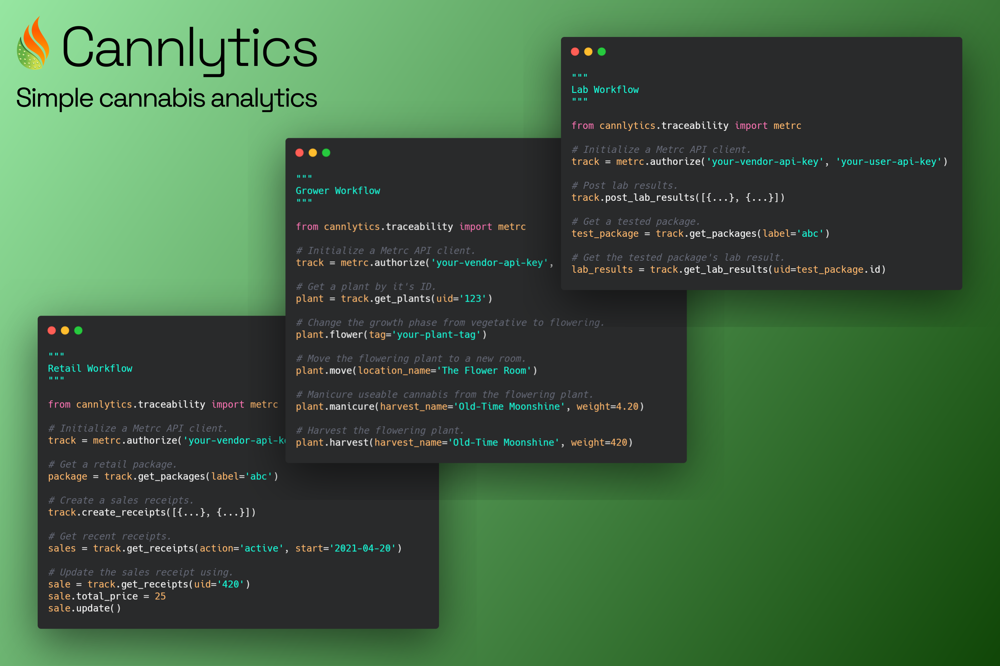
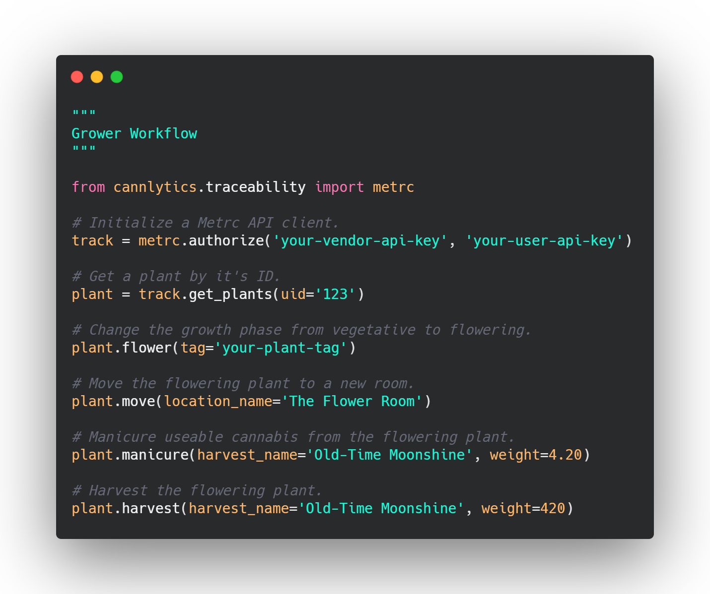
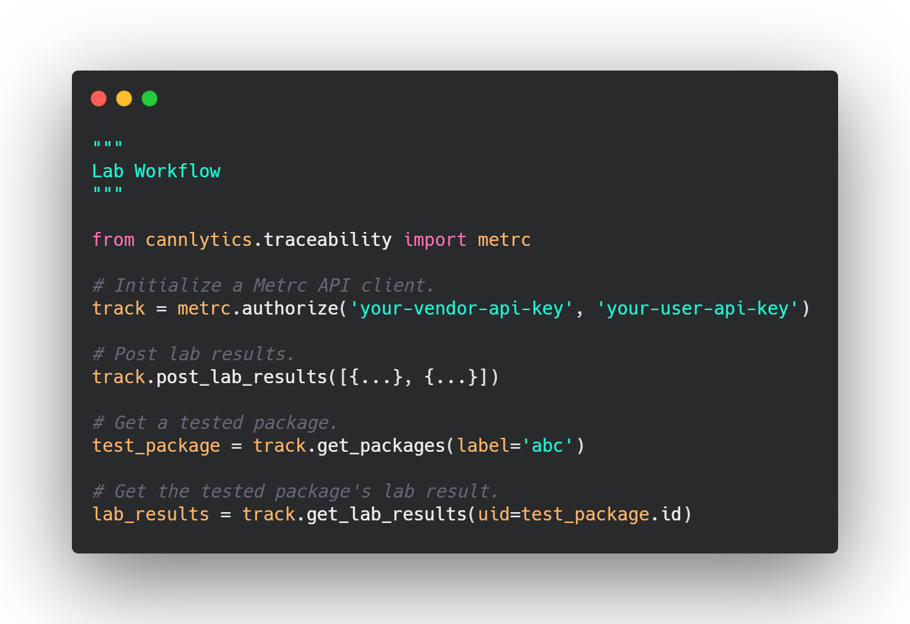
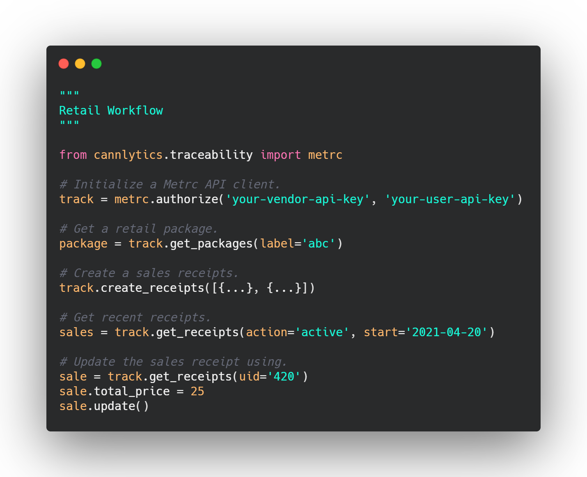

<div style="text-align:center; margin-top:1rem; margin-bottom: 1rem;">
  
  <div style="margin-top:1rem; margin-bottom:1rem;">
    <h3>Simple, easy, cannabis analytics.</h3>
  </div>

[](https://opensource.org/licenses/MIT)
[](https://pypi.org/project/cannlytics)

<https://cannlytics.com>

</div>


<div style="text-align:center; margin-top:1rem; margin-bottom: 1rem;">
  
</div>

Cannlytics provides a user-friendly interface to quickly receive samples, perform analyses, collect and review results, and publish certificates of analysis (CoAs). There are also built in logistics, CRM (client relationship management), inventory management, and invoicing tools. The Cannlytics engine comes with **batteries included**, but you are always welcome to supercharge your setup with modifications and custom components.

- [🚀 Installation](#installation)
- [🐱‍👓 Documentation](#documentation)
- [🗝️ Authentication, Data, and File Management](#development)
- [🧐 Traceability](#automation)
- [🤝 Contributing](#contributing)
- [❤️ Support](#support)
- [🏛️ License](#license)

## 🚀 Installation <a name="installation"></a>

You can install the Cannlytics engine from [PyPI](https://pypi.org/project/cannlytics/).

```shell
pip install cannlytics
```

You can also simply clone the repository to get your hands on the Cannlytics source code.

```shell
git clone https://github.com/cannlytics/cannlytics-engine.git
```

## 🐱‍👓 Documentation <a name="documentation"></a>

Please refer to the [Cannlytics Developer Guide](https://docs.cannlytics.com/) for detailed information about the module.

## 🗝️ Authentication, Data, and File Management

Cannlytics leverages Firebase by default for a database, file storage, and authentication.

## 🧐 Traceability <a name="traceability"></a>

Cannlytics supports the [Metrc](https://api-ok.metrc.com/Documentation) API out-of-the-box with batteries included. Simply plug in (your API keys) and play.

Producer / processor workflow:



Lab workflow:



Retail workflow:



<!-- ## Contributing -->

<!-- This should include how new contributors to the project can help. This includes developing new features, fixing known issues, adding documentation, adding new tests, or reporting issues. -->

## 🤝 Contributing <a name="contributing"></a>

Contributions are always welcome! You are encouraged to submit issues, functionality, and features that you want to be addressed. You can email <keegan@cannlytics.com> to get a quick start. Anyone is welcome to contribute anything.

## ❤️ Support <a name="support"></a>

Cannlytics is made available with ❤️ and <a href="https://opencollective.com/cannlytics-company">your good will</a>. Please consider making a contribution to keep the good work coming 🚢

🥞 Bitcoin donation address: 34CoUcAFprRnLnDTHt6FKMjZyvKvQHb6c6

## 🏛️ License <a name="license"></a>

```
Copyright (c) 2021 Cannlytics

Permission is hereby granted, free of charge, to any person obtaining a copy
of this software and associated documentation files (the "Software"), to deal
in the Software without restriction, including without limitation the rights
to use, copy, modify, merge, publish, distribute, sublicense, and/or sell
copies of the Software, and to permit persons to whom the Software is
furnished to do so, subject to the following conditions:

The above copyright notice and this permission notice shall be included in all
copies or substantial portions of the Software.

THE SOFTWARE IS PROVIDED "AS IS", WITHOUT WARRANTY OF ANY KIND, EXPRESS OR
IMPLIED, INCLUDING BUT NOT LIMITED TO THE WARRANTIES OF MERCHANTABILITY,
FITNESS FOR A PARTICULAR PURPOSE AND NONINFRINGEMENT. IN NO EVENT SHALL THE
AUTHORS OR COPYRIGHT HOLDERS BE LIABLE FOR ANY CLAIM, DAMAGES OR OTHER
LIABILITY, WHETHER IN AN ACTION OF CONTRACT, TORT OR OTHERWISE, ARISING FROM,
OUT OF OR IN CONNECTION WITH THE SOFTWARE OR THE USE OR OTHER DEALINGS IN THE
SOFTWARE.
```
